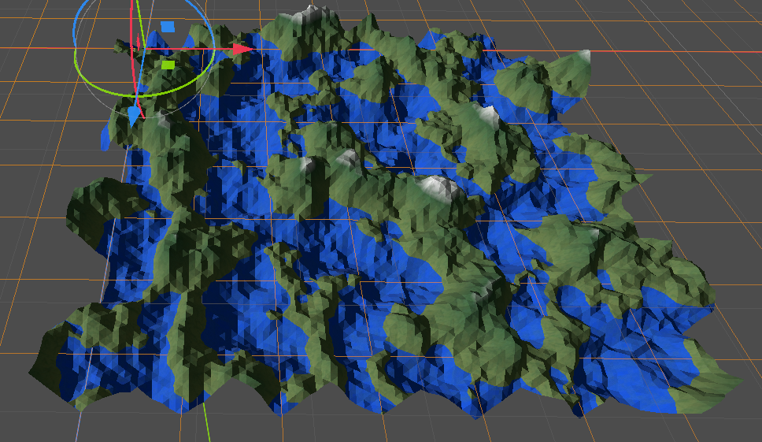
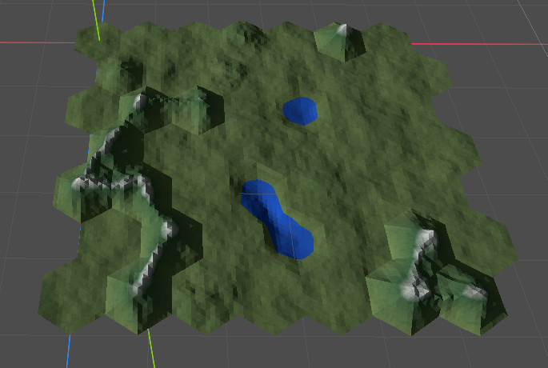

# Ridge-based terrain generation

## Main steps
Ridge-based generation uses groups of hexagons. There are 4 different types: water, plain, hill, moutain. After ROWxCOLUMN matrix of BiomeTile's is calculated following is done:
1. Assign mapping from CubeCoordinate of hexagon to hexagon.
2. Group different types of hexagons. It's processed by DSU class which implements naive disjoint set union algorithm.
3. Assign initial heights to vertices of all hexagons. Specific noise function is used for this. Let's call it "Plain noise" 
4. For each hexagon final heights are calculated:
    - Generated noise values are normalized. In code it's called "shift" and "compress" 
    - Based on type of hexagon, heights are modified: there is no modification for plain hexagon, trivial modification for hills, and ridge based modification for mountains and water. Linear interpolation is used for mountains and cosine for water

## Neighbours, ridges and borders
Each hexagon may have up to 6 neighbours. It doesn't matter for some types, e.g. "plain" and "hill", and does matter for other, i.e. "moutain" and "water". Ridges are calculated based on neighbours and their configuration

Ridge is a simple polygonal chain. It can be tuned in some way. Interface to tune is partially present in GUI, see "Variation Min(Max) bound"

Border is one of 6 bounds of hexagon if across this line there is no neighbour from the same group. Let's illustrate described above for groups of mountain hexagons:

